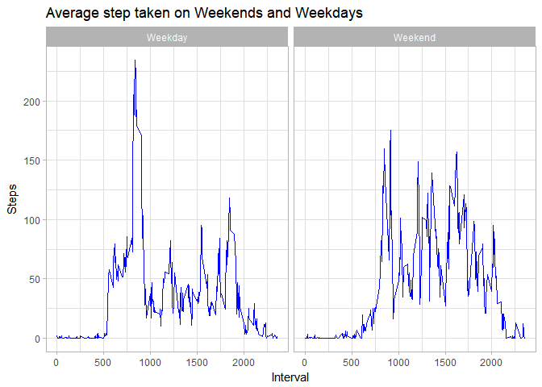

# Reproducible Research: Peer Assessment 1

## Loading and preprocessing the data

Let's first load the activity.csv file in a variable and perform necessary transformations such as date conversion.


```r
# Load "activity.csv" file.
activity <- read.csv("../activity.csv")

#Conver the character data into date data.
activity$date <- as.Date(activity$date, "%Y-%m-%d")

# Show the result of the conversion
class(activity$date)
```

```
## [1] "Date"
```

Now, we are all set. We will use 'activity' dataset in rest of the project.

***

## What is mean total number of steps taken per day?


```r
# Calculate the total number of steps taken per day
TotalSteps <- aggregate(steps ~ date, activity, na.rm = TRUE, sum)

# Show the data for first 10 days
head(TotalSteps,10)
```

```
##          date steps
## 1  2012-10-02   126
## 2  2012-10-03 11352
## 3  2012-10-04 12116
## 4  2012-10-05 13294
## 5  2012-10-06 15420
## 6  2012-10-07 11015
## 7  2012-10-09 12811
## 8  2012-10-10  9900
## 9  2012-10-11 10304
## 10 2012-10-12 17382
```


```r
# Make a histogram of the total number of steps taken each day
g <- ggplot(data = TotalSteps, aes(steps))

g <- g + 
     geom_histogram (stat = "bin", bins = 20, colour = "#000000") + 
     xlab("Date") + 
     ylab("Frequency") +
     ggtitle("Total Steps") +
     theme_light()

print(g)
```

<!-- -->

```r
#Calculate and report the mean and median of the total number of steps 
#taken per day mean of steps taken
mean(TotalSteps$steps)
```

```
## [1] 10766.19
```

```r
#median of steps taken
median(TotalSteps$steps)
```

```
## [1] 10765
```

***

## What is the average daily activity pattern?


```r
# Make a time series plot (i.e. type = "l") of the 5-minute interval (x-axis) 
# and the average number of steps taken, averaged across all days (y-axis)

# Calculate the total steps taken in each interval
TotalSteps <- aggregate(steps ~ interval, activity, na.rm = TRUE, sum)

# Now plot the graph
plot(TotalSteps$interval, 
     TotalSteps$steps, 
     type = "l", 
     xlab = "Interval", 
     ylab = "Steps Taken", 
     main = "Steps taken at 5 min interval", 
     col = "blue")
```

<!-- -->

```r
#Find out the 5-minute interval, on average across all the days in the dataset, 
#contains the maximum number of steps?
TotalSteps[which.max(TotalSteps$steps),]$interval
```

```
## [1] 835
```

***

## Imputing missing values

```r
#Calculate and report the total number of missing values in the dataset 
#(i.e. the total number of rows with NAs)
sum(is.na(activity$steps))
```

```
## [1] 2304
```

Devise a strategy for filling in all of the missing values in the dataset. The strategy does not need to be sophisticated. For example, you could use the mean/median for that day, or the mean for that 5-minute interval, etc.

I am substituting the NAs with the mean of that particular time interval across the dataset.


```r
# Find out indices of all the NAs in the dataset
nas <- which(is.na(activity$steps))

# Create alternate dataset with one extra column, bin. Bin is caculated as
# interval MODULO 60. It is divided by 5 and 1 is added to make it usable as index
new.data <- mutate(activity, bin = ((activity$interval %% 60)/5)+1)

# Calculate mean of the steps for each bin.
means <- aggregate(steps ~ bin, new.data, mean)

# Replace each NA with the corresponing mean steps from 'means' dataset
for (t in nas) {
    new.data$steps[t] <- means$steps[new.data$bin[t]]
}
```
New dataset new.data does not have any NAs


```r
sum(is.na(new.data$steps))
```

```
## [1] 0
```


```r
#Make a histogram of the total number of steps taken each day and Calculate and 
#report the mean and median total number of steps taken per day. Do these values 
#differ from the estimates from the first part of the assignment? What is the 
#impact of imputing missing data on the estimates of the total daily number 
#of steps?

par(mfrow = c(2,1))

TotalSteps <- aggregate(steps ~ date, new.data, sum)
hist(TotalSteps$steps, 
     breaks = 20, 
     main = "Total Steps taken per day (Mean)", 
     xlab = "Steps",
     col = "lightgreen",
     border = "darkgreen")
abline(v = mean(TotalSteps$steps), 
       lwd = 2)

#totalsteps <- aggregate(steps ~ date, dt, sum)
hist(TotalSteps$steps, 
     breaks = 20, 
     main = "Total Steps taken per day (Median)", 
     xlab = "Steps",
     col = "lightblue",
     border = "blue")
abline(v = median(TotalSteps$steps), 
       lwd = 2)
```

<!-- -->

```r
par(mfrow = c(1,1))
```


***
## Are there differences in activity patterns between weekdays and weekends?


```r
# Create a new factor variable in the dataset with two levels - "weekday" and "weekend" indicating whether a given date is a weekday or weekend day.
new.data <- activity

new.data$day <- ""

new.data$day[!(weekdays(new.data$date) == "Saturday" | weekdays(new.data$date) == "Sunday")] <- "Weekday"

new.data$day[weekdays(new.data$date) == "Saturday" | weekdays(new.data$date) == "Sunday"] <- "Weekend"

new.data$day <- as.factor(new.data$day)

class(new.data$day)
```

```
## [1] "factor"
```

```r
levels(new.data$day)
```

```
## [1] "Weekday" "Weekend"
```

```r
#Make a panel plot containing a time series plot (i.e. type = "l") of the 5-minute interval (x-axis) and the average number of steps taken, averaged across all weekday days or weekend days (y-axis). See the README file in the GitHub repository to see an example of what this plot should look like using simulated data.
WeekdayMean <- aggregate(steps ~ interval + day, new.data, mean, na.rm = TRUE)

g <- ggplot(WeekdayMean, aes(interval, steps))
g <- g + 
    facet_grid(. ~day) +
    xlab("Interval") +
    ylab("Steps") +
    ggtitle("Average step taken on Weekends and Weekdays")+
    geom_line(color = "blue") +
    theme_light()


print(g)
```

<!-- -->
